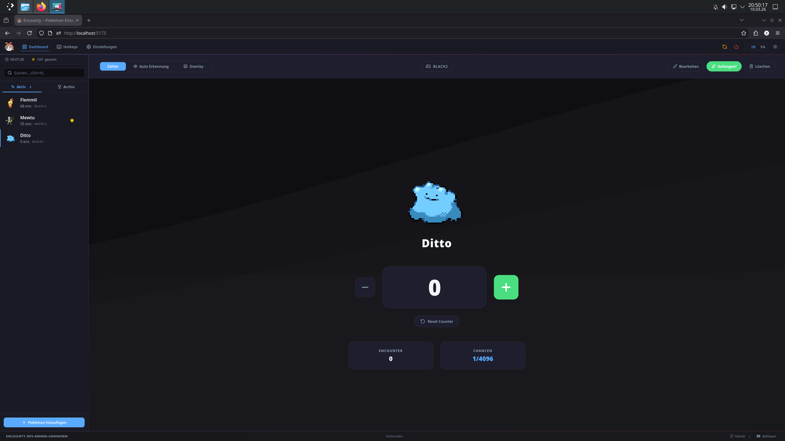
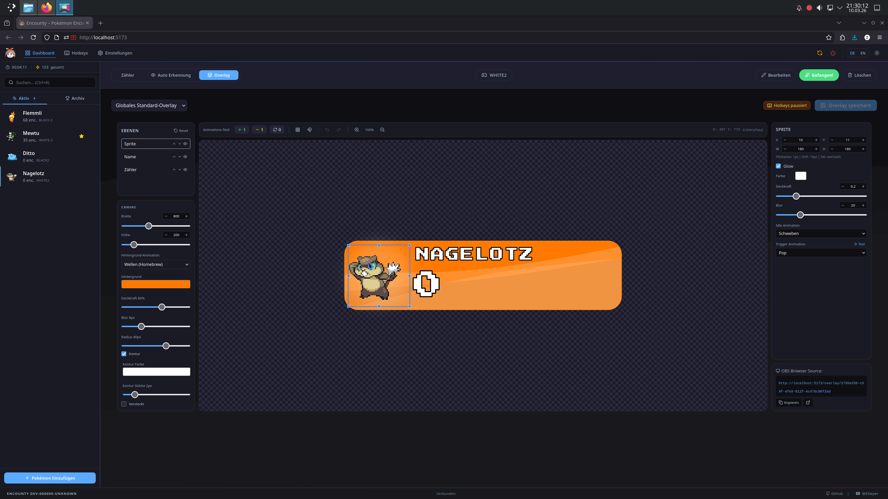
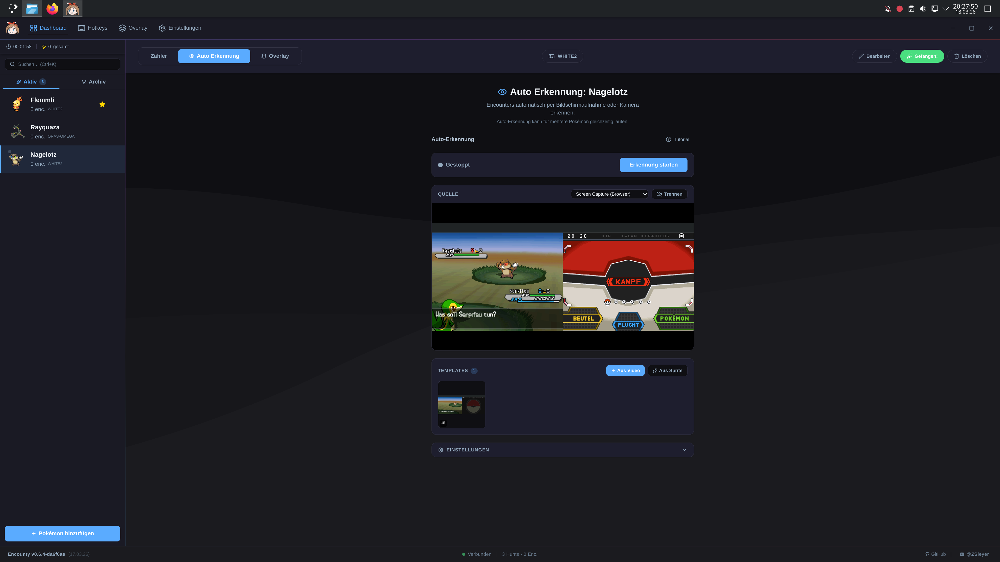
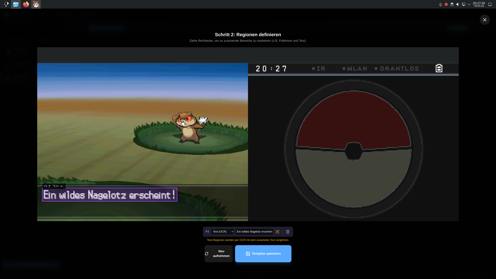

# Encounty


Encounty is a modern, open-source encounter tracker for Pokémon games. It uses text and image recognition to automatically detect and count encounters, enabling unlimited multi-hunts — limited only by your hardware. Manual tracking via global hotkeys is also supported.

## Download

**[⬇ Download the latest version here](https://github.com/ZSleyer/Encounty/releases/latest)**

Choose the file matching your operating system:

- **Windows**: `Encounty.exe`
- **Linux**: `Encounty.AppImage`

All releases can be found on the [Releases](https://github.com/ZSleyer/Encounty/releases) page.

## Support

Encounty is a hobby project provided free of charge. There is no official support.

## Compatibility

The application is currently only tested on and known to be compatible with:

- **Linux**: Wayland only (no X11/Xwayland support for capture; tested on Arch Linux)
- **Windows**: Windows 11 only (version 21H2+)

> [!IMPORTANT]
> macOS and other Linux/Windows versions are currently unsupported as of 2026, and there are no plans to support them.

## Features

- **WebGPU-accelerated NCC template matching** — GPU-powered detection with near-zero CPU overhead
- Browser-native **lossless preview** via `getDisplayMedia` / `getUserMedia`
- Unlimited simultaneous multi-hunts with independent capture streams
- Manual tracking with configurable global hotkeys
- Customizable dashboard with real-time stats
- OBS overlay editor with drag-and-drop and live preview


*Modern, customizable dashboard with real-time stats.*


*Powerful overlay editor with drag-and-drop and real-time preview.*


*Auto-detection system for encounter counting.*


*Auto-detection templates for encounter counting.*

## How It Works

1. The browser captures your screen, window, or camera feed (per Pokémon)
2. WebGPU compute shaders run NCC template matching directly on the GPU
3. A match triggers an automatic encounter count increment
4. Results are broadcast in real-time via WebSocket to the dashboard and overlays

## Contributing

Pull requests are welcome! Whether it's translations, new features, or bug fixes — feel free to contribute.

## Development

### Prerequisites

| Tool | Version | Notes |
|------|---------|-------|
| Go | 1.25+ | Backend API server |
| Node.js | 22+ | Frontend build and Electron |
| Yarn | any | Package manager (`npm install -g yarn`) |
| Make | any | Build orchestration |

### Architecture

Encounty uses a two-process architecture with all detection running in the browser:

- **Go backend** — pure API server and state coordinator (`/api/*`, `/ws`); hotkeys, file output, SQLite persistence, and frontend asset serving for OBS overlays
- **Electron** — desktop shell that manages the Go process lifecycle and hosts the browser-based capture and detection engine

The frontend captures screen, window, or camera feeds via `getDisplayMedia` / `getUserMedia`, runs NCC template matching through WebGPU compute shaders, and renders live previews — all with near-zero CPU overhead. In production, the Go backend also serves the frontend SPA so OBS can load overlays directly from `http://localhost:8080/overlay/{id}`.

```text
backend/          Go API server (REST + WebSocket)
  internal/
    server/       HTTP handlers, SPA serving, Swagger UI
    detector/     Browser detector state machine (score-based)
    gamesync/     Game catalogue + PokéAPI sync
    pokedex/      Pokédex data + GraphQL sync
    updater/      Auto-update + platform binary replacement
    state/        In-memory state manager
    database/     SQLite persistence (normalized v2 schema)
    hotkeys/      Platform-native global hotkeys (evdev / Win32)
    fileoutput/   OBS text file integration
frontend/         React + TypeScript SPA (Vite, Tailwind CSS 4, Zustand)
  src/engine/     WebGPU NCC detection engine (WGSL compute shaders)
  src/contexts/   CaptureService (per-pokemon MediaStream management)
electron/         Electron wrapper (custom protocol, process manager)
```

### Running in Development

```bash
# Start backend + frontend via Make
make dev

# Or start each process manually in separate terminals
cd backend  && go run -ldflags="-X main.version=dev" main.go --dev   # :8080
cd frontend && yarn dev                                                # :5173
cd electron && yarn dev                                                # optional Electron window
```

The Vite dev server (`:5173`) proxies `/api` and `/ws` to the Go backend (`:8080`).
Electron in dev mode loads from Vite and does not spawn its own Go process.

### API Documentation

Swagger UI is available at `http://localhost:8080/swagger/` when the backend is running.

### Building from Source

```bash
# Go backend
make build-linux               # Linux amd64 binary + dist-linux/ bundle
make build-windows             # Windows amd64 binary

# Electron desktop app (bundles Go backend + frontend)
make electron-package-linux    # AppImage
make electron-package-windows  # Portable exe

# Utilities
make swagger                   # Regenerate OpenAPI spec
make test                      # Go + frontend tests
make coverage                  # Coverage reports (filtered)
make clean                     # Remove all build artifacts
```

### Testing

```bash
make test                            # All tests (Go + frontend)
```

## License

This project is licensed under the [GNU Affero General Public License v3 (AGPLv3)](LICENSE).
