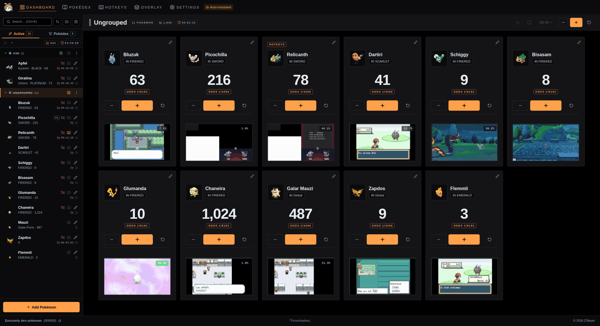
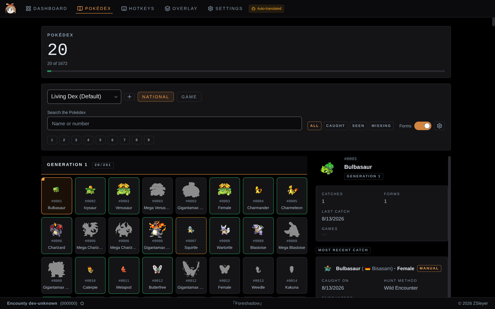

# Encounty

[](https://github.com/ZSleyer/Encounty/actions/workflows/ci.yml)
[](https://github.com/ZSleyer/Encounty/actions/workflows/ci.yml)
[](https://github.com/ZSleyer/Encounty/actions/workflows/ci.yml)
[](LICENSE)
[](https://github.com/ZSleyer/Encounty/releases/latest)
[](https://github.com/ZSleyer/Encounty/releases)

Encounty is a modern, open-source auto shiny counter for Pokemon shiny hunting. It captures your game screen directly in the app, runs GPU-accelerated template matching to detect encounters automatically, and supports unlimited parallel hunts, limited only by your hardware. Everything runs locally: no account, no cloud, no paywall.

Under the hood: four fused scoring metrics (block SSIM, Pearson correlation, mean absolute difference, histogram correlation), multi-scale NCC template matching, a three-phase hysteresis state machine against double counts, and automatic template calibration. Details in [Features](#features).

**[Website](https://zsleyer.github.io/Encounty/)** · **[Download & install guide](https://zsleyer.github.io/Encounty/update.html)** · **[Changelog](https://zsleyer.github.io/Encounty/changelog.html)**



## Download

**[Download Encounty for Linux, macOS, and Windows](https://github.com/ZSleyer/Encounty/releases/latest)**

| Platform                   | Architecture | File                          |
|----------------------------|--------------|-------------------------------|
| Linux (Wayland)            | x64          | `Encounty-x86_64.AppImage`       |
| Linux (Wayland)            | arm64        | `Encounty-arm64.AppImage`     |
| macOS (26+)                | arm64        | `Encounty-arm64.dmg`          |
| Windows 11 (26H1+)         | x64 + arm64  | `Encounty-Setup.exe`          |

### Arch Linux (AUR)

Arch and Arch-based distributions can install the [`encounty-bin`](https://aur.archlinux.org/packages/encounty-bin) package with an AUR helper such as [yay](https://github.com/Jguer/yay) or [paru](https://github.com/Morganamilo/paru):

```bash
yay -S encounty-bin
```

## How It Works

1. Capture your game screen, window, or camera feed (one source per hunt)
2. Encounty compares each frame against your template images on the GPU to detect encounters automatically
3. Built-in safeguards prevent false positives and double-counts
4. Every confirmed encounter updates your counter in real time, including any connected OBS overlays

## Features

### Detection engine

- **GPU-accelerated auto-detection** via WebGPU compute shaders with automatic CPU/worker fallback, easy on your CPU while you play
- **Multi-metric matching**: every frame is scored by a fusion of block SSIM, Pearson correlation, mean absolute difference, and histogram correlation instead of a single naive pixel diff
- **Position- and scale-tolerant sprite matching** through true NCC template matching with integral images and multi-scale search, so a region does not have to sit pixel-perfect
- **No double counting**: a three-phase hysteresis state machine (latch, cooldown, count) with miss tolerance and noise-floor handling makes sure each encounter is counted exactly once
- **Text regions with offline OCR**: mark the encounter text instead of a sprite. Tesseract runs locally with bundled language data, so a template works without a network connection
- **Region categories**: regions combine with AND inside a category and OR across categories, and every category counts on its own, so a single capture source can drive several counters at once
- **3D mode**: a template can leave its match when the region content really changes instead of when the score drops, which is what 3D games with moving cameras need
- **Replay-based screenshots**: pick the perfect template frame from a replay recording instead of hoping to hit the right moment
- **Automatic stability analysis**: every template is analysed up front and Encounty tells you how reliably it will match before you start hunting, including data-driven parameter calibration
- **Simulation-based calibration**: the measured score timeline is replayed through the real state machine over a parameter grid, and the combination that confirms the encounter exactly once with the largest margin wins
- **Guided template creation** in a step-by-step flow: snapshot, mark the encounter text, test the match, done
- **Per-template settings**: precision, hysteresis, consecutive hits, cooldown and polling belong to the template, not to the hunt, so two templates on one hunt can behave differently
- **Adaptive polling** (50 ms to 2 s) with frame-change gating keeps idle CPU usage near zero
- **Survives a lost GPU**: a lost WebGPU device is detected and every running detection loop restarts by itself, and a force-CPU mode is one click away
- **Tested on real gameplay**: an automated quality suite replays real recordings from 2D and 3D games (Gen 3 through Gen 9) and requires exact encounter counts with zero double counts before a release ships. The recordings were kindly provided by [LEOsMIND](https://www.youtube.com/c/LEOsMINDplays) and are too large for the repository; method and current results are documented at [zsleyer.github.io/Encounty/testing.html](https://zsleyer.github.io/Encounty/testing.html)

### Hunt tracking

- **All mainline Pokémon games** from Gen 1 (Red/Blue/Yellow) through Gen 9 (Legends Z-A), plus Colosseum and XD, each with game-specific shiny odds
- **60+ hunt methods** including Masuda, Poké Radar, SOS chaining, DexNav, Mass Outbreaks, Sandwich hunts, and many more, each with its own odds model
- **Shiny Charm toggle** with accurate per-method odds for every supported game, plus the Sparkling Power level for Gen 9 sandwiches and the star or square shiny variant for Sword/Shield
- **Phase hunting for every method**: phase targets, phase history, an undo for the last phase, and a Failed status for a shiny that was sighted but got away
- **Groups and tags**: start, stop or reset a whole group at once, point the hotkeys at it, and share one capture source across every hunt in it
- **Statistics per hunt**: encounters over time, the cumulative shiny probability, milestones with an estimated time to reach them, and a log of every counted event
- **Unlimited simultaneous hunts** with independent capture streams
- **Hunt modes**: run the timer only, the detection only, or both together
- **Manual tracking** via configurable global hotkeys

### Pokédex & collection

- **Several configurable Pokédexes** next to the protected Living Dex, each filtered by generation, games, form categories, and explicit species
- **Every form as its own slot**: regional forms, Mega, Gigantamax and cosmetic forms included
- **Caught, seen and missing** filters, where a failed hunt marks the species seen without inflating the catch count
- **Hand-entered catches** for everything you did not hunt in Encounty, with the same details and phases as a tracked hunt
- **Full catch details** per individual: nickname, gender, met location, ball, level, nature, ability, mark, IVs and ribbons
- **Evolution history**: evolve a recorded Pokémon and it keeps its identity, its details and its place in the dex
- **Offline sprite cache**: sprites are fetched once and kept on disk, so the dex opens without a network connection



### Streaming & extras

- **OBS overlay editor** with drag-and-drop, undo/redo, snapping, layout templates, gradients, outlines, shadows, per-element animations, local fonts and background images
- **Overlay elements** for sprite, name, title, counter, timer, odds, phase, total counter and total timer, plus a universal browser-source URL that follows the active hunt
- **Text file output** for OBS text sources, written next to the database
- **Template import/export** to share detection templates or move them between machines
- **Backup and restore**: the whole database as a ZIP, taken WAL-safe while the app runs and validated before it replaces your live data
- **Your own storage location**: pick the folder the database lives in, and the OBS output folder moves with it
- **In-app updates** on Windows and Linux; a package-managed install (AUR) leaves updates to the package manager
- **Multi-language** support for English, German, Spanish, French, and Japanese

### Privacy & platform

- **Local-first**: works offline, no account, no cloud dependency; your hunts stay on your machine
- **No telemetry**: no analytics, no usage reporting, no crash pings; the repository contains nothing that phones home
- **Loopback only**: the backend binds to 127.0.0.1 and checks the origin and host of every request, so no other device and no website can reach it
- **Free**: no ads, no paywall, no pro tier
- **Cross-platform & multi-arch**: Linux (Wayland), Windows 11, and macOS on x64 and ARM64. Coming soon to your Toaster™
- **Made for long sessions**: dark and light theme, eight accent colours, interface zoom, reduced motion, crisp sprite scaling, and WCAG 2.2 AA throughout
- **Open source** under AGPL-3.0 with tested, typed code (Go backend, React frontend, Electron shell)

## Troubleshooting

Step-by-step install and update instructions per platform:

- [Linux](https://zsleyer.github.io/Encounty/update.html#linux)
- [macOS](https://zsleyer.github.io/Encounty/update.html#macos)
- [Windows](https://zsleyer.github.io/Encounty/update.html#windows)

## Contributing

Pull requests are welcome! See [CONTRIBUTING.md](CONTRIBUTING.md) for development setup, architecture, and build instructions. Encounty was built with the help of LLM coding assistants, without them a project of this scope wouldn't have been possible to build solo in this timeframe, so PRs created with the help of LLM agents are explicitly welcome too.

## License Notice

This project is licensed under the [GNU Affero General Public License v3 (AGPLv3)](LICENSE).

You are free to use, modify, and redistribute this software, provided that you fully comply with the terms of the AGPLv3. If you modify this software and make it available over a network or distribute it in any form, you must fulfill all obligations imposed by the license, including making the complete corresponding source code available.

Any use of this source code outside the permissions granted by the AGPLv3, including incorporating it into proprietary software without complying with the license, constitutes copyright infringement.

The author actively protects this project's intellectual property and reserves the right to investigate and pursue any license violations through all available legal remedies.
